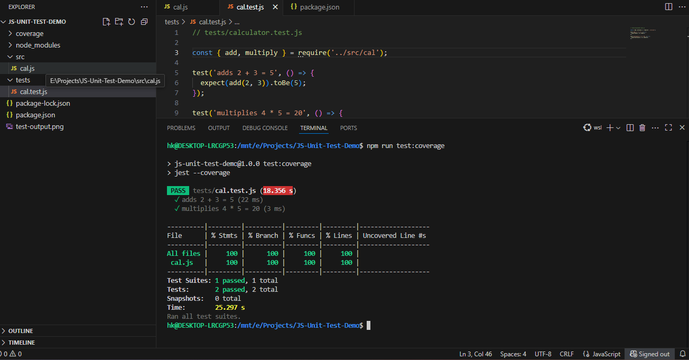
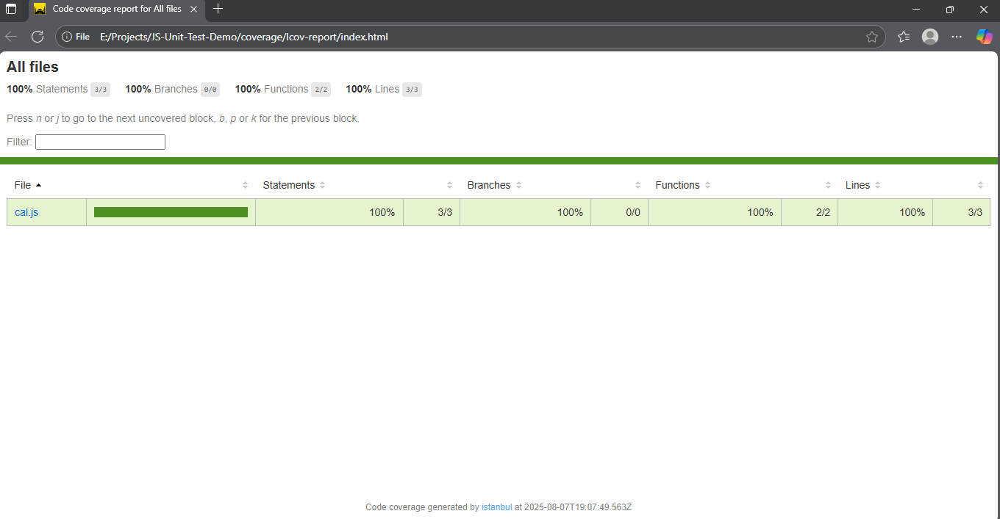
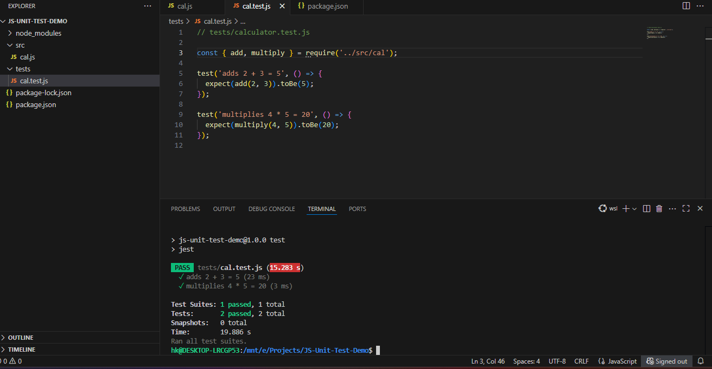

# 🧪 JavaScript Unit Testing with Jest

This is a simple JavaScript project to demonstrate unit testing using [Jest](https://jestjs.io/).

## 📁 Project Structure

js-unit-test-demo/
├── src/
│ └── calculator.js # Source code file with add and multiply functions
├── tests/
│ └── calculator.test.js # Unit tests for calculator.js
├── package.json # Project configuration with Jest scripts
├── README.md # Project documentation

## ⚙️ Prerequisites

- [Node.js](https://nodejs.org/en/) (v14 or higher recommended)
- `npm` (comes with Node.js)


## 🚀 Getting Started

1. Clone the repository or download the files.

2. Install dependencies:

```bash
npm install
Run tests:

npm test
Run tests with coverage report:

npm run test:coverage


🧠 Example Functions

cal.js

function add(a, b) {
  return a + b;
}

function multiply(a, b) {
  return a * b;
}

module.exports = { add, multiply };


🧪 Sample Test File

cal.test.js

const { add, multiply } = require('../src/cal');

test('adds 2 + 3 = 5', () => {
  expect(add(2, 3)).toBe(5);
});

test('multiplies 4 * 5 = 20', () => {
  expect(multiply(4, 5)).toBe(20);
});

📊 Code Coverage Report

After running:

npm run test:coverage

## 📊 Test Coverage




Jest will generate a coverage report in the coverage/ folder. You can open coverage/lcov-report/index.html in your browser to view a detailed breakdown.



Author : Harsh Kashyap